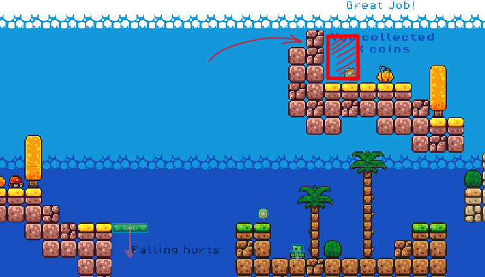

# 2D Platformer Assignment

## Requirements

1. **Review Tutorial Video _[20 marks]_**

    Watch Brackeys video tutorial on Godot 2D Platformer Game Development. The video can be found here: 
    
    [How to make a Video Game - Godot Beginner Tutorial](https://www.youtube.com/watch?v=LOhfqjmasi0).

1. **Player Updates _[2 marks]_**

    1. Add health (player starts with 100 health) and damage system _(for example player takes 10 damage per hit)_
    1. Add life counter _(every time player dies, life counter decreases by 1)_

1. **New Enemy _[2 marks]_**

    Create a new slime that does less damage than the original slime but moves faster. The new slime should have a different sprite than the original slime. This slime does 20 damage per hit.

1. **Level Design _[10 marks]_**

    Using the Godot builtin level editor create a 2D platformer level using the provided tileset. The level should be designed in a way that the player can reach the end of the level by jumping from platform to platform. The level should be challenging but not impossible to complete. The level should also include collectible items that the player can pick up to increase their score.

    The size of the level should be atleast 2 screens wide.

1. **Score System _[2 marks]_**

    Create a score system that increases every time the player picks up a collectible item.

1. Going to Next Level _[2 marks]_

    We did one level in the class. You made the second one. Now add an **"invisible collider"** at the end of the first level _(shown in the picture below)_ such that when the player collides with it, the player is taken to the next level that you created.

    

1. **Game Over Screen _[2 marks]_**

    Create a game over screen that displays when the player runs out of lives. The game over screen should display the player's score and allow the player to restart the game.

## Submission

**Submission Date:** Thursday 9th May 2024

Submission via github
